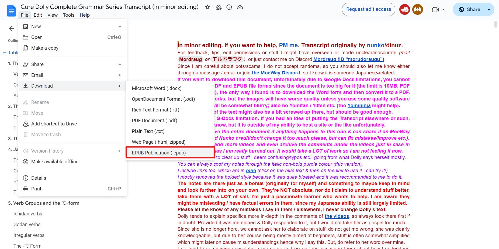

epub dosyaları içindeki PNG resim dosyalarını pngquant (https://pngquant.org) yardımıyla sıkıştırabilen basit bir Python betiği. Özelde YouTube'da yer alan "Organic Japanese with Cure Dolly"nin Japonca gramer videolarının transkipsiyonun yer aldığı "Cure Dolly Complete Grammar Series Transcript (in minor editing)" dosyasının epub çıktısını sıkıştırması için oluşturulmuştur. pngquant programının PATH'de olması gerekmektedir.

# Usage

`
python.exe opt.py --help
`

```
usage: opt.py [-h] [-i EPUB_INPUT]

A simple Python script that can compress the PNG files inside the epub files, in this case "Cure Dolly Complete Grammar Series Transcript (in minor
editing)" which can be fount at: https://docs.google.com/document/d/1XpuXerkGU8waJ4DPDNJA4bGeqOvM-csXjTe57iHARHc, with the help of pngquant
(https://pngquant.org). pngquant should be in the PATH.

options:
  -h, --help            show this help message and exit
  -i EPUB_INPUT, --input EPUB_INPUT
                        Path of the input epub file.
```


*Yukarıda bağlantısı verilen Google Docs belgesini epub dosyası biçiminde indirmeniz gerekmektedir.*

# Katkıda Bulunanlar
Bu betiğin yaptığı çok da bir şey yok açıkcası, asıl değerli katkıları verenler aşağıda sıralanmıştır.

- [Organic Japanese with Cure Dolly](https://www.youtube.com/@organicjapanesewithcuredol49): Japonca (gramer) videolarının hazırlaryıcı.
- [Mordraug/Nunko](https://docs.google.com/document/d/1XpuXerkGU8waJ4DPDNJA4bGeqOvM-csXjTe57iHARHc) Videoların transkipsiyonunu yapıp Google Docs'a aktaran kişi/ler.
- [pngquant](https://pngquant.org) PNG sıkıştırmasında kullanılan program.