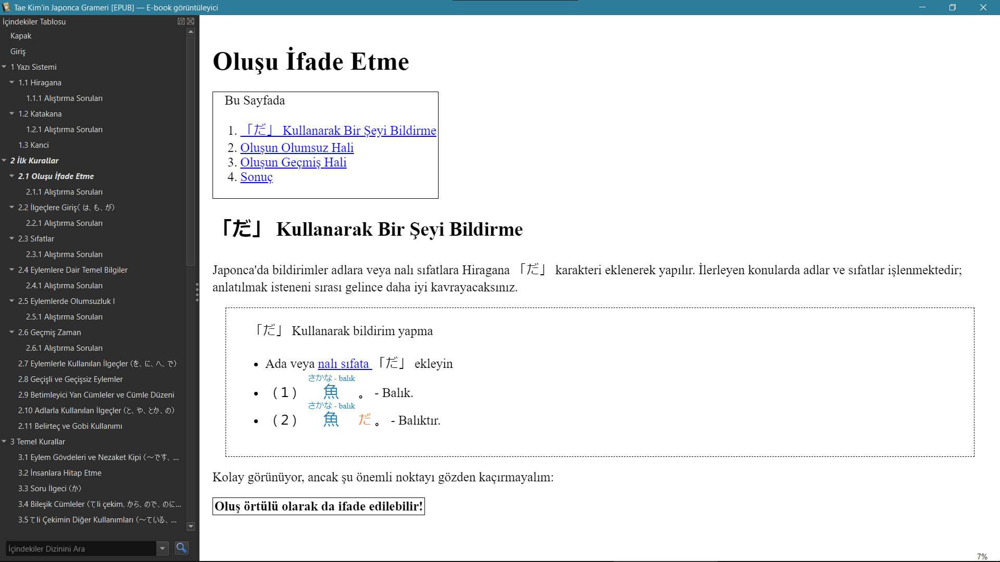

https://guidetojapanese.org/turkish/index.html adresinde yer alan Japonca dil bilgisi rehberi Türkçe çevirisinin ePub versiyonunu oluşturan bir Python betiği.

# Kullanımı
[requirements.txt](requirements.txt) klasöründe bulunan paketlerin yüklü olması gerekmektedir. Bunlar yüklendikten sonra betik çalıştırılır:

`
python japonca_dilbilgisi_epub.py
`

epub dosyası betikle aynı konuma kaydedilecektir.

# Değişiklikler

- Web tarayıcısında fare ile üzerine gelindiğinde gösterilen kanji okunuşları ve tanımları HTML ruby etiketine dönüştürülmüştür. Bu sayede dosya e-kitap okuyucular gibi fare girdisi olmayan cihazlarda okunsa bile okunuş ve tanımlar ilgili kanjinin üstünde görünecektir. (Aşağıdaki ekran görüntüsünde bir örneği görülebilir.)

- Kılavuzda kanji sözlüğü olarak yönlendirilen [Jim Breen's WWWJDIC](https://users.monash.edu/~jwb/wwwjdic.html) site [Jisho](https://jisho.org/) ile değiştirilmiştir.

*epub dosyasının önizlemesi.*

# Katkıda bulunanlar

- [Tae Kim](https://guidetojapanese.org/learn/) -  Kılavuz Tae Kim tarafından hazırlanmış ve gönüllüler tarafından diğer dillere çevrilmiştir.